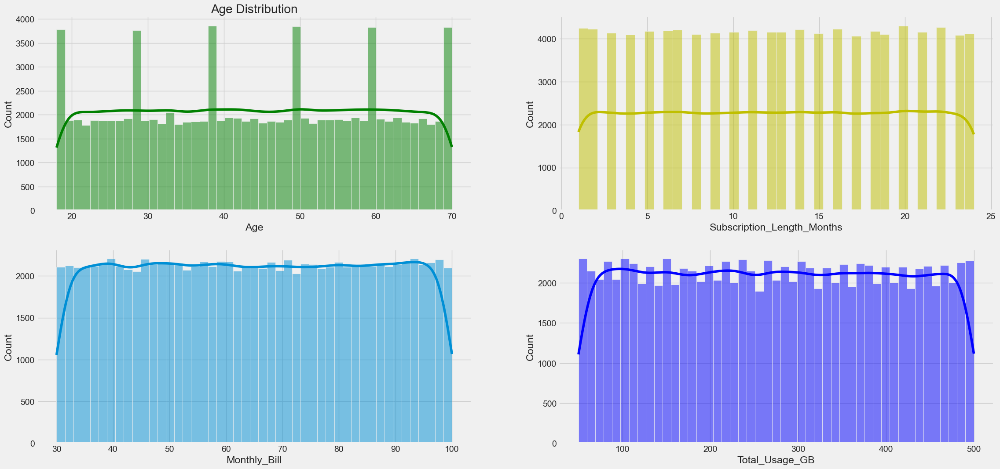
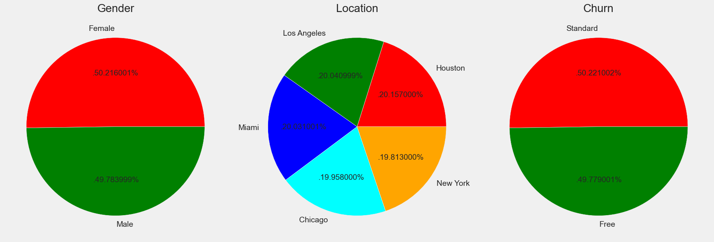
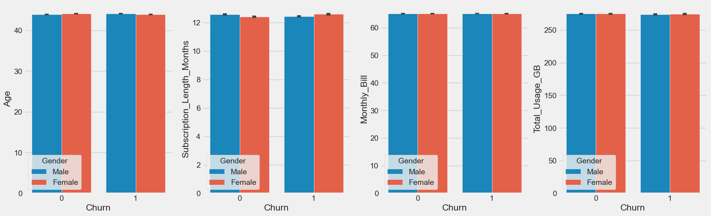

## Customer Churn Prediction 

## Data Insights:
- #### Numerical Data Points are equally distributed.

<!--  -->
- #### Almost equally distribution of each class in each feature.

<!--  -->
- #### With respect to churn (equal contribution of all classes)

<!--  -->

